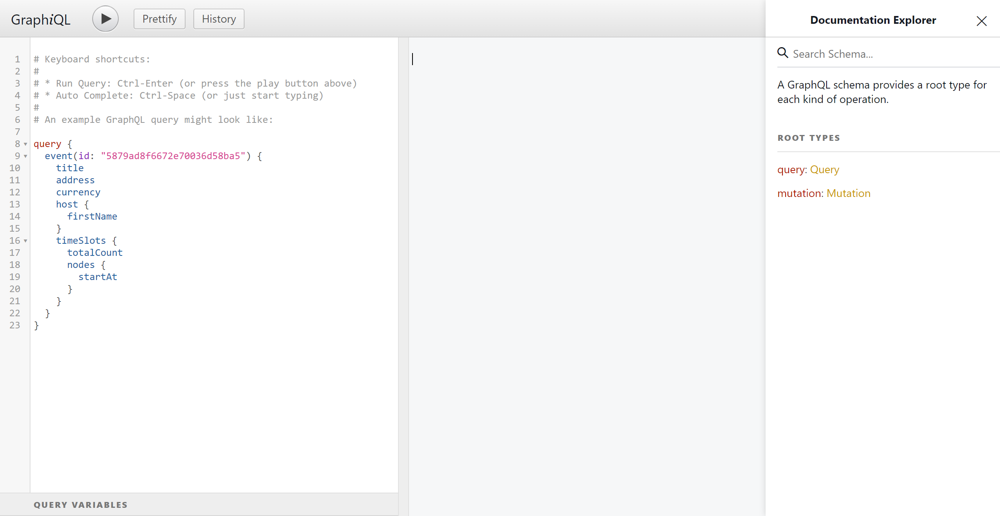
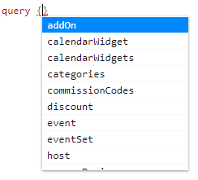
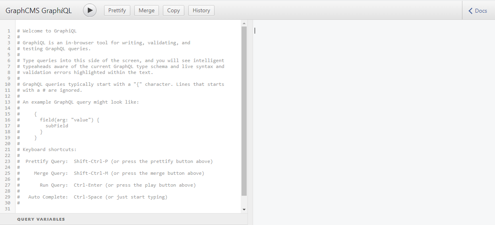
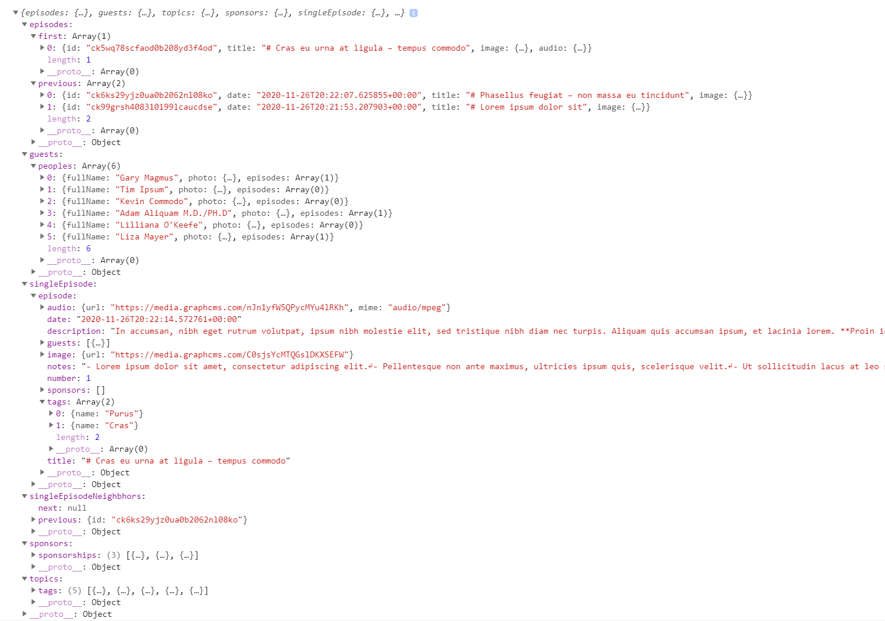

<!-- omit in toc -->
# An Introduction to GraphQL (part 1)

In this project, we will create a website that fetches data from a [GraphQL](https://graphql.org) endpoint. The endpoint exposes data related to an imagined podcast called *GraphQL FM*.


You can take a look at the final project at [https://repl.it/@ritza/GraphQL-FM](https://repl.it/@ritza/GraphQL-FM). You can also view it as a standalone page by pressing the `Open in a new tab` button (at the top right of the former link) or by going straight to [https://graphql-fm.ritza.repl.co](https://graphql-fm.ritza.repl.co/).

We will create the above example in two separate steps. Part 1 (this article) covers the basics of GraphQL and setting up our API. [Part 2](./graphql-project-part-2) will show how we can turn the data from the GraphQL API into a fully functional website. We will start with the following:

- [Creating Your Own Project on Replit](#creating-your-own-project-on-replit)
- [Our GraphQL Goals for This Guide](#our-graphql-goals-for-this-guide)
  - [What is GraphQL?](#what-is-graphql)
  - [GraphQL as an alternative to REST](#graphql-as-an-alternative-to-rest)
  - ["Hello World" in GraphQL](#hello-world-in-graphql)
  - [Using a GraphQL Explorer](#using-a-graphql-explorer)
  - [Adding GraphQL to JavaScript](#adding-graphql-to-javascript)
- [Creating an API](#creating-an-api)
  - [GraphQL as a Service](#graphql-as-a-service)
  - [Custom GraphQL Function](#custom-graphql-function)
  - [Defining an Information Architecture](#defining-an-information-architecture)
  - [Loading the Data](#loading-the-data)

## Creating Your Own Project on Replit

If you haven't already, head to the [signup page](https://repl.it/signup) and create a Replit account. Once created, set up a new project by:

1. Clicking on the `+ New repl` button.
2. Choosing the "HTML, CSS, JS" language. 
3. Giving your repl a name: In our case, "graphql-fm".
4. Clicking the `Create repl` button.


Because we selected "HTML, CSS, JS" as our language, Replit has created the basic files needed for our front-end project, which should be:

- `index.html`
- `style.css`
- `script.js`

## Our GraphQL Goals For This Guide


Our goals are to: 

* Gain familiarity with GraphQL as a concept.
* Illustrate how we can use GraphQL in native JavaScript code without requiring any additional libraries or frameworks. 

This means that even if you are already familiar with GraphQL but have only experienced it through libraries like [Apollo](https://www.apollographql.com) or [Relay](https://relay.dev), you will find value by learning how to make use of GraphQL by using the native JavaScript [Fetch API](https://developer.mozilla.org/en-US/docs/Web/API/Fetch_API).

### What is GraphQL?

You might have seen definitions of GraphQL that look like this one:

> *“I have seen the future, and it looks a lot like GraphQL. Mark my words: in 5 years, newly minted full-stack app developers won’t be debating RESTfulness anymore, because REST API design will be obsolete. […] It lets you model the resources and processes provided by a server as a domain-specific language (DSL). Clients can use it to send scripts written in your DSL to the server to process and respond to as a batch.”*
>
>— [Alan Johnson](https://artsy.github.io/author/alan/): [*Is GraphQL The Future?*](http://artsy.github.io/blog/2018/05/08/is-graphql-the-future/)

Let's take a look at what this actually means. Specifically, a "[domain-specific language](https://en.wikipedia.org/wiki/Domain-specific_language)" (DSL) is a programming language created to express a very specific and narrow type of digital information (a domain). While a [general-purpose language](https://en.wikipedia.org/wiki/General-purpose_programming_language) like [JavaScript](https://en.wikipedia.org/wiki/JavaScript) can be used to express a wide range of digital information, domain-specific languages tend to be more limited. However, it is precisely because of their narrow scope that DSLs can be easier to read and write when compared to general-purpose languages.

Because of this limited scope, DSLs are often embedded inside other languages as they often need to piggyback on the larger functionality provided by general-purpose languages. However, this does not mean that DSLs are tied to specific languages. For example, [SQL](https://en.wikipedia.org/wiki/SQL) (Structured Query Language) is another domain-specific language that is used to query database structures like [MySQL](https://www.mysql.com) or [Postgres](https://www.postgresql.org). Yet, SQL has the same exact syntax whether embedded inside JavaScript, [Python](https://en.wikipedia.org/wiki/Python_(programming_language)) or [PHP](https://en.wikipedia.org/wiki/PHP).

As an example, in JavaScript (via [Node](https://en.wikipedia.org/wiki/Node.js)) you might do the following:

```js
const { createConnection } = require('mysql');

const connection = createConnection({
  host: "localhost",
  user: "yourusername",
  password: "yourpassword",
  database: "mydb"
});

connection.query("SELECT * FROM customers");
```

Whereas in Python, you might do this:

```python
import mysql.connector

db = mysql.connector.connect(
  host="localhost",
  user="yourusername",
  password="yourpassword",
  database="mydatabase"
)

db.cursor().execute("SELECT * FROM customers")
```

You will note that the SQL expression (`SELECT * FROM customers`) is the exact same regardless of the environment. Similarly, GraphQL allows us to express **specific data queries** independently of how (or where) we use them.

### GraphQL as an alternative to REST

GraphQL can be used to express almost any type of data request. As an example, the immensely popular [Gatsby React framework](https://www.gatsbyjs.com) uses GraphQL to query [frontmatter](https://jekyllrb.com/docs/front-matter) and [plain text](https://en.wikipedia.org/wiki/Plain_text) inside [Markdown](https://en.wikipedia.org/wiki/Markdown) files. Yet, in the majority of cases, GraphQL is used as an alternative to a traditional [REST](https://en.wikipedia.org/wiki/Representational_state_transfer) (Representational State Transfer) approach.

For a long time, REST was considered the de-facto standard for sending data between a browser and a server. Its popularity stems from the wide range of standardised operations it allows. These range from receiving data ([GET](https://developer.mozilla.org/en-US/docs/Web/HTTP/Methods/GET)), sending data ([POST](https://developer.mozilla.org/en-US/docs/Web/HTTP/Methods/POST)), merging two data structures ([PATCH](https://developer.mozilla.org/en-US/docs/Web/HTTP/Methods/PATCH)) or even removing data ([DELETE](https://developer.mozilla.org/en-US/docs/Web/HTTP/Methods/DELETE)). However, the primary drawback of REST is that it relies on the creation of fixed data endpoints. This means that a single request is only scoped to a specific, pre-defined set of data. [Chimezie Enyinnaya](https://blog.pusher.com/author/mezie/), a Nigerian content creator for [Pusher](https://pusher.com) (a service that manages remote [pub/sub](https://en.wikipedia.org/wiki/Publish%E2%80%93subscribe_pattern) messaging), explains it as follows:

> *“With REST, we might have a `/authors/:id` endpoint to fetch an author, then another `/authors/:id/posts` endpoint to fetch the post of that particular author. Lastly, we could have a `/authors/:id/posts/:id/comments` endpoint that fetches the comments on the posts. […] It is easy to fetch more than the data you need with REST, because each endpoint in a REST API has a fixed data structure which it is meant to return whenever it is hit.”*
>
>— [Chimezie Enyinnaya](https://blog.pusher.com/author/mezie/): *[REST versus GraphQL](https://blog.pusher.com/rest-versus-graphql/)*

GraphQL was created as a solution to this problem. Facebook created it to provide a standardized syntax to write more expressive (and powerful) data queries within the Facebook mobile app when fetching remote data.

### "Hello World" in GraphQL

So where does one start with GraphQL?

There are several GraphQL libraries that provide useful abstractions when working with GraphQL. The most popular are Apollo and Relay. While these provide a lot of helpful features, like [cache management](https://www.apollographql.com/docs/react/caching/cache-configuration/) and [normalization](https://www.apollographql.com/blog/demystifying-cache-normalization), they can be overwhelming to someone just starting with GraphQL. They also tend to be quite large and opinionated – meaning that they might be overkill for smaller, more flexible projects.

GrahpQL is an open standard (similar to HTML). It is therefore not locked to any specific tool, library or platform. This means that we are able to use GraphQL directly with the [native JavaScript fetch API](https://developer.mozilla.org/en-US/docs/Web/API/Fetch_API), or even with a light-weight [AJAX](https://en.wikipedia.org/wiki/Ajax_(programming)) library like [Axios](https://www.npmjs.com/package/axios). In the example below, we will establish what the '[Hello World](https://en.wikipedia.org/wiki/%22Hello,_World!%22_program)' equivalent of GraphQL in JavaScript would be. In other words:

### Using a GraphQL Explorer

Most GraphQL endpoints come with some form of GraphQL explorer, the most popular being [GraphiQL](https://github.com/graphql/graphiql) and [GraphQL Playground](https://github.com/graphql/graphql-playground). As an example, let's start with a public GraphQL endpoint provided by the event management platform [Universe.com](https://www.universe.com/graphiql). Their endpoint allows developers to retrieve data associated with specific events in their database. We can use their explorer to create and test a super basic query.

If you go to [https://universe.com/graphiql](https://universe.com/graphiql), you should see the following:



The left-hand (white) pane allows you to write specific queries, whereas the middle (grey) pane shows the response from the endpoint once you run the query. Lastly, the right-hand (white) pane contains the documentation generated by the endpoint (if it is hidden, click on the top-right button that says "*< Docs*"). The play button (the sideways triangle in the upper-left) executes the current query, whereas "Prettify" reformats your query according to best practice (in terms of layout). "History" allows you to see queries used previously in the explorer.

We can run the default starting query (at the time of writing) and we'll get a [JSON](https://en.wikipedia.org/wiki/JSON)-like response that looks something like this:

```json
{
  "data": {
    "event": {
      "title": "End of Unix Time",
      "address": "Los Angeles, CA, USA",
      "currency": "USD",
      "host": {
        "firstName": "Joshua"
      },
      "timeSlots": {
        "totalCount": 2,
        "nodes": [
          {
            "startAt": "2018-08-31T12:00:00"
          },
          {
            "startAt": "2038-01-18T21:00:00"
          }
        ]
      }
    }
  }
}
```
Let's take a look at what just happened. We'll clear the left-hand pane and recreate the query step-by-step. 

We can start by adding `query { }`. This indicates to the endpoint that we want to retrieve data from the server.

Place your cursor within the curly brackets and press the spacebar and enter keys at the same time. We should get a list of recommended queries (based on the structure of the data) as follows:



As per our initial example, let's reselect `event`. This means that we want to retrieve information associated with a specific event. The event we are interested in has a unique ID of `5879ad8f6672e70036d58ba5`. We can pass this ID as an argument to the query (similar to how we would with JavaScript functions) as follows: `event(id: "5879ad8f6672e70036d58ba5") { }`.

Now that we've identified the event that we want to query, we can instruct GraphQL to only retrieve the information that we're interested in. This prevents the response from returning the entire event data-structure (called [over-fetching](https://stackoverflow.com/questions/44564905/what-is-over-fetching-or-under-fetching) in REST). In order to illustrate the dynamic nature of GraphQL, we will be querying completely different data associated with the event as shown in the example below:

```graphql
query {
  event(id: "5879ad8f6672e70036d58ba5") {
    active
    address
    url
  }
}
```

Notice that our initial example had **nested queries**. This is where the distinction between GraphQL and REST becomes central. Everything we've done up until this point very much adheres to the way we would think about a traditional REST request.

REST requests function similar to a traditional JavaScript function, where we provide specific arguments and we get a pre-determined response based on the arguments. GraphQL works a bit differently. GraphQL queries are like little maps used to navigate and find all requested data in a single journey. This means that we can conceptualize a set of real-world instructions by means of the GraphQL syntax as follows:

```jsx
instructions {
  travel(type: "drive") {
    mall {
      travel(type: "walk") {
        general_store {
          food_isle {
            bread
            peanut_butter
          }
          stationary_isle {
            pens (amount: 12)
            paper
          }
        }
        hardware_store {
          nails
          hammer
        }
      }
    }
    post_office {
      packages
      mail
    }
  }
}
```

Since GraphQL is a [graph-like structure](https://en.wikipedia.org/wiki/Graph_(abstract_data_type)), we can get information loosely related to our event without creating a completely new request. This is where GraphQL really shines when compared to REST! You can think of these as roads or pathways connecting different places. In other words, if you are in the mall (as per our example above), you can go directly to the `general_store_store` in that `mall` and then to the `hardware_store` afterwards. Furthermore, because the `mall` is connected to the `post_office` by a road, you can then drive to the `post_office` afterwards.

Due to the map-like nature of queries, we can actually have a query that follows a circular route, ending up exactly where it started (there is no real practical reason for this, but it demonstrates the graph foundations of GraphQL).

```graphql
query {
  event(id: "5879ad8f6672e70036d58ba5") {
    active
    address
    url

    timeSlots {
      nodes {
        event {
          active
          address
          url
        }
      }
    }
  }
}
```

### Adding GraphQL to JavaScript

Let's take the above query built within the GraphiQL explorer and place it in our JavaScript file. This allows us to request the above data directly from our browser:

_Note that the following example assumes familiarity with the native JavaScript [Fetch API](https://developer.mozilla.org/en-US/docs/Web/API/Fetch_API). If this is the first time you are encountering it, learn [How to Use the JavaScript Fetch API to Get Data](https://www.digitalocean.com/community/tutorials/how-to-use-the-javascript-fetch-api-to-get-data)._

```jsx
const QUERY = `
  query {
    event(id: "5879ad8f6672e70036d58ba5") {
      active
      address
      url

      timeSlots {
        nodes {
          event {
            active
            address
            url
          }
        }
      }
    }
  }
`

const FETCH_OPTIONS =   {
  method: 'POST',
  body: JSON.stringify({ query: QUERY }),
}

fetch('https://universe.com/graphiql', FETCH_OPTIONS )
  .then(response => response.json())
  .then(console.log)
```

The above should output something as follows to the browser console:

```json
{
  "data": {
    "event": {
      "title": "End of Unix Time",
      "address": "Los Angeles, CA, USA",
      "currency": "USD",
      "host": {
        "firstName": "Joshua"
      },
      "timeSlots": {
        "totalCount": 2,
        "nodes": [
          {
            "startAt": "2018-08-31T12:00:00"
          },
          {
            "startAt": "2038-01-18T21:00:00"
          }
        ]
      }
    }
  }
}
```

## Creating an API


Congratulations, you can now write basic GraphQL queries!

Next, we'll want to create our own endpoint, since being restricted to data from [Universe.com](http://universe.com) is limiting. There are several server-side GraphQL frameworks. Some extremely popular examples are [express-graphql](https://www.npmjs.com/package/express-graphql) for Node (running [Express](https://expressjs.com/)) and [Graphene](https://graphene-python.org/) for Python servers. Alternatively, there are several all-in-one solutions like [Prisma](https://www.prisma.io/) or [Hasura](https://hasura.io/) that come with databases included.

### GraphQL as a Service

For the sake of simplicity, we will be using a free [software as a service](https://en.wikipedia.org/wiki/Software_as_a_service) (SaaS) platform called [GraphCMS](https://graphcms.com/). This allows us to get a custom GraphQL endpoint up with minimal set up.

To follow along:
1. Visit [https://graphcms.com](https://graphcms.com/) and sign up for a free account. 
2. Once your account has been created, create a new sample project by selecting the "Podcast Starter" template. 
3. Make sure that "Include template content" is selected, as this will populate our API with placeholder information. 
4. Add or edit content to the API using the GraphCMS project dashboard, but make sure that you don't change the schema since we will be relying on it to write our queries.

_Note that GraphCMS allows you to create a new project completely from scratch, however for our purposes we only want to have a working endpoint with placeholder content. If you are interested in diving deeper into GraphCMS, you can consult their documentation at [https://graphcms.com/docs](https://graphcms.com/docs)._

Once your project has been created, you can select the _"Settings"_ tab at the bottom-left corner, and navigate to "API Access". Make sure to copy the endpoint URL (at the top of the page) and save it somewhere where you will be able to access it later. We'll be directing all our GraphQL queries to this URL, so it is useful to have it at hand.


Note that your API endpoint should look something like the following: 

```
https://api-us-east-1.graphcms.com/v2/ckll20qnkffe101xr8m2a7m2h/master
```

However, in the next code examples, we'll use `<<<YOUR ENDPOINT HERE>>>` to prevent you from accidentally using an example endpoint if you are following along. If you navigate straight to your endpoint within your browser, you will be presented with a GraphiQL Explorer that allows you to test and try out queries for your specific endpoint:



### Custom GraphQL Function

We will be making several GraphQL queries from our website. For this purpose, it is helpful to create a basic abstraction (using a JavaScript function) that handles these requests in order to reduce boilerplate code. We can convert our JavaScript example above into a basic JavaScript function as follows:

_Note that the following section assumes familiarity with the [async/await operators](https://en.wikipedia.org/wiki/Async/await) in JavaScript. If you are unfamiliar with them, have a look at the [following guide on the Mozilla Developer Network](https://developer.mozilla.org/en-US/docs/Learn/JavaScript/Asynchronous/Async_await)._

```jsx
const gqlQuery = async (query) => {
  const REQUEST_OPTIONS = { method: 'POST', body: JSON.stringify({ query }) };

  const response = await fetch('<<<YOUR ENDPOINT HERE>>>', REQUEST_OPTIONS)
  
  if (!response || !response.ok) {
    throw new Error('Query failed');
  }
  
  const { data } = await response.json();
  return data;
}
```

This allows us to pass a query to the function, which in return provides a response once the query resolves. We also include a check-in the function to determine whether the response succeeded (by checking if it returned a `200` status, by means of `response.ok`).

This means that we should be able to do the following:

```jsx
const QUERY = `
  query {
    episodes {
      title
    }
  }
`

gqlQuery(QUERY).then(console.log)
```

This works, but it always returns an array of **all** the episodes from our entire database. If we only want the two most recent episodes, we can do the following in our query:

```graphql
query {
  episodes(first: 2) {
    title
  }
}
```

However, this isn't very flexible, since it means that we'll need to create an entire new query each time we want get a specific number of episodes. Luckily, GraphQL lets us pass variables as part of the query. For example, if we have a look in our GraphiQL explorer, we can do the following (you might need to click on "QUERY VARIABLES" in the bottom-left corner to open it up):


You'll see that we can pass variables as a JSON object, and then within the query we can declare the expected variables in brackets (`( )`) right after the `query` command. The variable names should always start with a dollar sign (`$`). In our case, we can specify that we are expecting `$count`. However, because GraphQL is [strongly typed language](https://en.wikipedia.org/wiki/Strong_and_weak_typing) we are required to declare what type of data `$count` will be. In this case, it will be an `Int` value. We then pass the value of `$count` directly to `episodes(first: $count)`. To replicate this within our JavaScript, we can add variables to our body as follows:

_If you are not familiar with the concept of strongly typed languages, read [the following guide](https://flaviocopes.com/loosely-strongly-typed) by [Glavio Copes](https://flaviocopes.com/)._

```jsx
const gqlQuery = async (query, variables) => {
  const REQUEST_OPTIONS = { method: 'POST', body: JSON.stringify({ query, variables }) };

  const response = await fetch('<<<YOUR ENDPOINT HERE>>>', REQUEST_OPTIONS)
  
  if (!response || !response.ok) {
    throw new Error('Query failed');
  }
  
  const { data } = await response.json();
  return data;
}
```

This means that we'll be able to do the following (which will respectively log the first, first-two and first-three episodes to the console):

```jsx
const QUERY = `
  query ($count: Int) {
    episodes(first: $count) {
      title
    }
  }
`

gqlQuery(QUERY, { count: 1 }).then(console.log)
gqlQuery(QUERY, { count: 2 }).then(console.log)
gqlQuery(QUERY, { count: 3 }).then(console.log)

```

### Defining an Information Architecture

With our endpoint now set up, we need to start mapping out all the information we want to show on each page. In the world of user experience, we call this [information architecture](https://en.wikipedia.org/wiki/Information_architecture) mapping.

As an example, consider the following basic outline, which we'll use as a reference when requesting data from the endpoint:

```markdown
# GraphQL FM Website

## Episodes Page (Default Landing Page)

- The first episode (for hero banner)
  - Unique ID (This will be used as the URL when viewing the episode)
  - Episode name
  - Cover image URL
  - Audio
    - File URL
    - File type (for example `.mp3`, `.wav`, etc.)

- Previous episodes (all episodes after the first one)
  - Unique ID (This will be used as the URL when viewing the episode)
  - Published date
  - Episode name
  - Cover image URL

## Single Episode Page
	
- Previous episode ID (if applicable)
- Next episode ID (if applicable)

  - Current episode
  - Episode number
  - Published date
  - Episode name
  - Cover image URL
  - Show notes
  - List of topics associated with episode
  - Audio
    - File URL
    - File type (for example `.mp3`, `.wav`, etc.)
  - List of guests
    - Name of each guest
    - Photo URL of each guest
  - List of episode sponsors
    - Name of sponsoring  company
    - Website URL of sponsoring company

## Guests Page

- List of guests
  - Name of each guest
  - Photo URL of each guest
  - List of episodes that appeared on
    - Unique ID (This will be used as the URL when viewing the episode)
    - Date that each episode was published
    - Episode name for each episode
    - Cover image URL for each episode

## Topics Page

  - A list of all topics
    - The name of each topic
    - All episodes associated with a specific topic
      - Unique ID if the episode (This will be used as the URL when viewing the episode)
      - The date that each episode was published
      - The name of each episode
      - The cover image URL of each episode

## Resources Page

  - A list of all resources
    - The filename of each individual resource
    - The file type (for example `.mp3`, `.wav`, etc.) of each resource
    - The URL where each individual resource can be downloaded

## Sponsors Page

  - A list of all sponsors
    - The company name associated with each sponsorship
    - All the episodes that a specific company is sponsoring
      - Unique ID if the episode (This will be used as the URL when viewing the episode)
      - The date that each episode was published
      - The name of each episode
      - The cover image URL of each episode
```

### Loading the Data

While creating our information architecture, one thing immediately stands out: there are some specific data co-configurations that are called multiple times. Luckily, the GraphQL standardization allows for something called [fragments](https://graphql.org/learn/queries/#fragments). Fragments helps keep our queries DRY (a programming acronym for [Don't Repeat Yourself](https://en.wikipedia.org/wiki/Don%27t_repeat_yourself)). The most common co-configuration seems to be the data required to show a preview of a specific episode. 

We can wrap this in a GraphQL fragment as follows (very similar to how we would create a query itself in JavaScript):

```js
const EPISODE_PREVIEW_FRAGMENT = `
  fragment EpisodePreview on Episode {
    id
    date: publishedAt
    title
    image {
      url
    }
  }
`
```

We can then use it in a specific query as follows (by using JavaScript [string interpolation](https://developer.mozilla.org/en-US/docs/Web/JavaScript/Reference/Template_literals#expression_interpolation)):

```js
const GUESTS_PAGE_QUERY = `
  query {
   peoples {
    fullName
    photo {
      url
    }
    episodes: appearedOn {
      ...EpisodePreview
    }
  }
 }

  ${EPISODE_PREVIEW_FRAGMENT}
```

It is common practice to place fragments **after** the query expression instead of declaring them before the query, because the query should first and foremost be expressive. We should rather include fragments as footnotes for reference. Using our information architecture and the fragment declared above, we can replace all the content in our JavaScript file with the following:

```js
const EPISODE_PREVIEW_FRAGMENT = `
  fragment EpisodePreview on Episode {
      id
      date: publishedAt
      title
      image {
        url
      }
  }
`

const EPISODES_PAGE_QUERY = `
	query {
    first: episodes(first: 1) {
      id
      title
      image {
        url
      }
      audio: audioFile {
        url
        mime: mimeType
      }
    }

    previous: episodes(skip: 1) {
      ...EpisodePreview,
    }
  }
  
  ${EPISODE_PREVIEW_FRAGMENT}
`;

const SINGLE_EPISODE_PAGE_QUERY = `
  query($id: ID) {
    episode(where: { id: $id }) {
      number: episodeNumber
      date: publishedAt
      title
      description
      notes: showNotes
      audio: audioFile {
        url
        mime: mimeType
      }
      image {
        url
      }
      guests {
        fullName
        photo {
          url
        }
      }
      tags {
        name
      }
      sponsors {
        company {
          name
          website
        }
      }
    }
  }
`;

const SINGLE_EPISODE_NEIGHBORS_QUERY = `
  query($previous: Int, $next: Int) {
    previous: episode(where: { episodeNumber: $previous }) { id }
    next: episode(where: { episodeNumber: $next }) { id }
  }
`;

const GUESTS_PAGE_QUERY = `
  query {
   peoples {
    fullName
    photo {
      url
    }
    episodes: appearedOn {
      ...EpisodePreview
    }
  }
 }
 
 ${EPISODE_PREVIEW_FRAGMENT}
`;

const TOPICS_PAGE_QUERY = `
  query {
    tags {
      name
      episodes {
        ...EpisodePreview
      }
    }
  }
  
  ${EPISODE_PREVIEW_FRAGMENT}
`;

const RESOURCES_PAGE_QUERY = `
  query {
     assets {
      fileName
      mimeType
      url
    }
  }
  
  ${EPISODE_PREVIEW_FRAGMENT}
`;

const SPONSORS_PAGE_QUERY = `
  query {
    sponsorships {
      company {
        name
      }
      episodes {
        ...EpisodePreview
      }
    }
  }
  
  ${EPISODE_PREVIEW_FRAGMENT}
`;

const gqlQuery = async (query, variables) => {
  const response = await fetch(
    "https://api-us-east-1.graphcms.com/v2/ckll20qnkffe101xr8m2a7m2h/master",
    {
      method: "POST",
      body: JSON.stringify({ query, variables })
    }
  );

  if (!response || !response.ok) {
    throw new Error("Query failed");
  }

  const { data } = await response.json()
  return data;
};

const getData = async () => {
  const episodes = await gqlQuery(EPISODES_PAGE_QUERY);
  const guests = await gqlQuery(GUESTS_PAGE_QUERY);
  const topics = await gqlQuery(TOPICS_PAGE_QUERY)
  const sponsors = await gqlQuery(SPONSORS_PAGE_QUERY)
  
  const [{ id }] = episodes.first;
  const singleEpisode = await gqlQuery(SINGLE_EPISODE_PAGE_QUERY, { id });

  const { number } = singleEpisode.episode;

  const singleEpisodeNeighbhors = await gqlQuery(
    SINGLE_EPISODE_NEIGHBORS_QUERY,
    { previous: number + 1, next: number - 1 }
  )

  console.log({
    episodes,
    guests,
    topics,
    sponsors,
    singleEpisode,
    singleEpisodeNeighbhors,
  });
};

getData();
```
If you run the above, you'll get one big object in your browser console. This object contains all the data that we'll be using in our website:



Having the data in our browser console is not enough. We need to do some additional work in order to structure it in HTML and CSS, to be consumed directly by users. In [part 2](./graphql-project-part-2), we'll walk through doing this, turning our data into a fully functional website.
